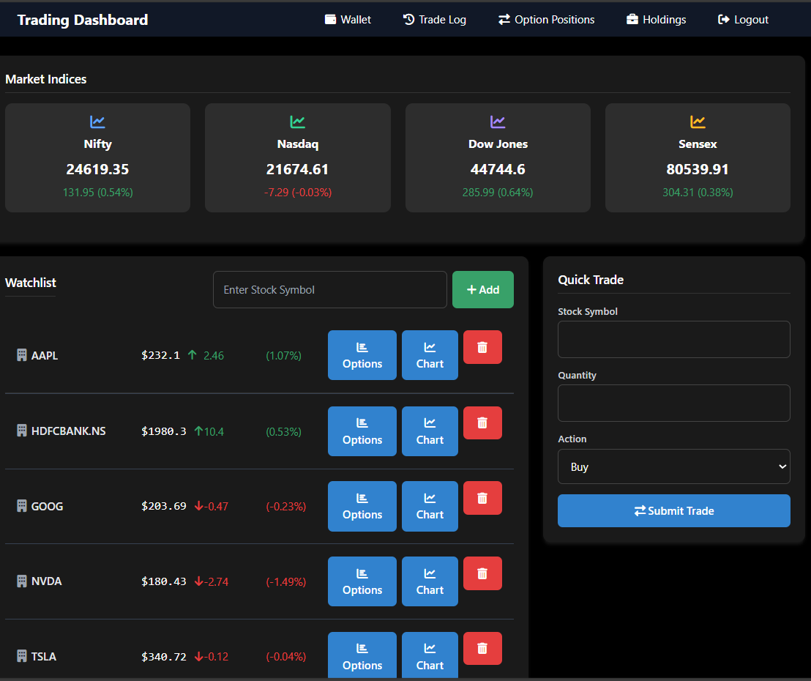

# Trading Dashboard (Flask + MySQL)

Beautiful, production-minded trading dashboard that showcases full‑stack skills: authentication (email + Google OAuth), watchlists, simulated trading (equities and options), live holdings P/L using Yahoo Finance, and clean Bootstrap UI.

<p align="center">
  
  
  
  
</p>

> Built for learning, demoing, and interviewing: clear architecture, secure patterns, and thoughtful UX. Easy to run locally on Windows/macOS/Linux.

## Dashboard Preview
<p align="center">
  
</p>

## Table of Contents
- [Features](#features)
- [Screenshots](#screenshots)
- [Architecture](#architecture)
- [Tech Stack](#tech-stack)
- [Local Setup](#local-setup)
- [Environment Variables](#environment-variables)
- [Database & Migrations](#database--migrations)
- [Running the App](#running-the-app)
- [Key Routes](#key-routes)
- [Security Notes](#security-notes)
- [Roadmap](#roadmap)
- [License](#license)


## Features
- **Auth**
  - Email/password login via `WTForms`
  - **Google OAuth** (OAuth 2.0 flow with CSRF-safe state)
- **Portfolio**
  - Holdings view with average price, current price, P/L and P/L%
  - Live quotes via `yfinance`
- **Watchlist**
  - Add/remove tickers with clean UI
- **Trading Simulator**
  - Market buy/sell flow with wallet balance and trade logs
  - Options: basic option chain view and option trade logging
 
- **Clean UI**
  - Bootstrap 5 templates under `templates/`


## Screenshots
Add screenshots to help recruiters quickly grasp UX. You can capture from the running app and place images in `assets/`.

<p align="center">
  
</p>
<p align="center">
  
</p>
<p align="center">
  
</p>


## Architecture
- `app.py`: Flask app, routes, Google OAuth, MySQL wiring
- `templates/`: Jinja templates (`home.html`, `login.html`, `watchlist.html`, `holdings.html`, ...)
- `migrations/`: SQL migration files (schema changes, OAuth columns, etc.)

High level flow:
1. User logs in (email/password) or via Google OAuth.
2. Watchlist and trading actions stored in MySQL.
3. Holdings P/L computed using `yfinance` close prices.
 


## Tech Stack
- Backend: Flask, Flask‑WTF, Flask‑MySQLdb
- Auth: Google OAuth 2.0 (`google-auth-oauthlib`, `google-auth`)
- Data: MySQL 8.x
- Market Data: `yfinance`
- UI: Bootstrap 5, Jinja2


## Local Setup
Below is a quick setup for Windows PowerShell; adapt for macOS/Linux as needed.

1) Clone repo
```
powershell
# Replace with your repository URL
git clone <your-repo-url>
cd dbms_cp
```

2) Create and activate virtualenv (recommended)
```
powershell
py -m venv .venv
.\.venv\Scripts\Activate.ps1
```

3) Install dependencies
```
powershell
pip install -r requirements.txt
```
If you don’t have a `requirements.txt` yet, generate one from your environment:
```
powershell
pip freeze > requirements.txt
```

4) Create database and user (MySQL)
```
SQL
CREATE DATABASE trading_website CHARACTER SET utf8mb4 COLLATE utf8mb4_unicode_ci;
-- Optionally create a dedicated user and grant privileges
```


## Environment Variables
Set these via a `.env` file or your shell. Do not hardcode secrets in source code.

```
# Flask
FLASK_SECRET_KEY=replace_me
FLASK_ENV=development
FLASK_RUN_PORT=5001

# MySQL
MYSQL_HOST=127.0.0.1
MYSQL_USER=root
MYSQL_PASSWORD=your_mysql_password
MYSQL_DB=trading_website

# Google OAuth (from Google Cloud Console)
GOOGLE_CLIENT_ID=your_client_id.apps.googleusercontent.com
GOOGLE_CLIENT_SECRET=your_client_secret
GOOGLE_REDIRECT_URI=http://localhost:5001/login/google/authorized

# Optional: disable HTTPS requirement for local dev (never in prod)
OAUTHLIB_INSECURE_TRANSPORT=1
```

Recommended: load these in Flask using `python-dotenv` or `os.environ.get()`.


## Database & Migrations
- Place SQL files in `migrations/`.
- Example: `migrations/add_google_auth_columns.sql` for adding OAuth columns to `users`.
- Apply migrations manually or with a simple script.

```
powershell
# Example manual apply
mysql -u root -p trading_website < migrations\add_google_auth_columns.sql
```

Core tables typically used:
- `users(id, username, email, password, google_id, ...)`
- `wallet(id, user_id, balance, ...)`
- `trade_log(id, user_id, stock_symbol, action, quantity, price, timestamp)`
 
- `option_trades(...)` (if present)


## Running the App
```
powershell
# Ensure env vars are set (PowerShell example)
$env:FLASK_SECRET_KEY="replace_me"
$env:MYSQL_PASSWORD="your_mysql_password"
$env:GOOGLE_CLIENT_ID="your_client_id.apps.googleusercontent.com"
$env:GOOGLE_CLIENT_SECRET="your_client_secret"
$env:GOOGLE_REDIRECT_URI="http://localhost:5001/login/google/authorized"
$env:OAUTHLIB_INSECURE_TRANSPORT="1"  # local only

# Start the server
python app.py
# or
flask --app app.py run --port 5001
```
Visit: http://localhost:5001


## Key Routes
- `/` Home
- `/login` Email/password login
- `/login/google` Google OAuth start
- `/login/google/authorized` OAuth callback
- `/watchlist` Manage tickers
- `/trade` Simulated equity trades
- `/holdings` Portfolio view with P/L
- `/option_chain` Options chain lookup
- `/option_trade_log` Option trade history
- `/wallet` Add funds and view balance


 


## Security Notes
- Never commit real secrets. Use environment variables or secret stores.
- Set `SESSION_COOKIE_SECURE=True` behind HTTPS in production.
- Restrict Google OAuth credentials to correct redirect URI.
- Validate and sanitize all user inputs on trade/upload routes.


## Roadmap
 
- Pagination and filters on logs
- Real-time prices via websockets
- Dockerfile + docker-compose (app + MySQL)
- Unit/integration tests (pytest)


## License
MIT — feel free to use for learning and portfolio projects. Attribution appreciated.
