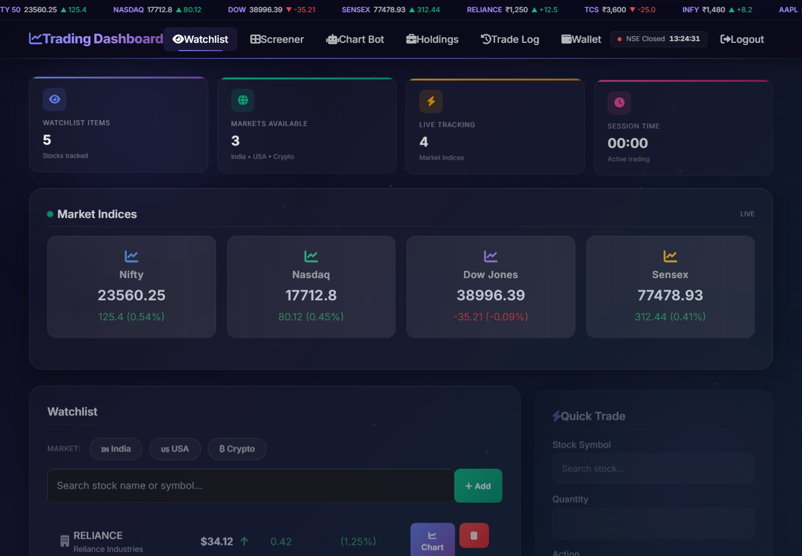
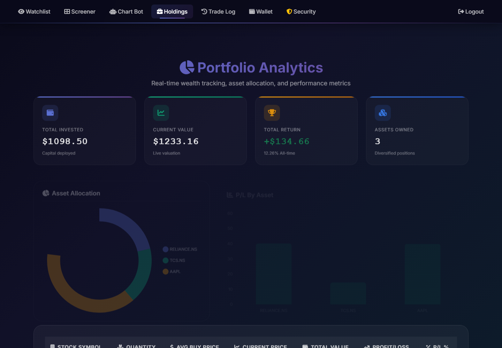
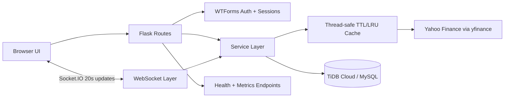

# Real-Time Trading Simulator and Portfolio Analytics

Full-stack trading simulator built with Flask, MySQL/TiDB, Flask-SocketIO, and Yahoo Finance data via `yfinance`. The project supports local authentication, virtual wallet balances, watchlists, simulated buy/sell trades, holdings P/L, market heatmaps, chart-bot signals, health checks, caching, and CI-tested deployment.

<p align="center">
  <a href="https://trading-1-mdz8.onrender.com/">
    
  </a>
</p>

[Deployment Guide](DEPLOYMENT.md) | [Performance Baseline](API_CALL_VERIFICATION.md)


## Screenshots

| Watchlist | Holdings |
| --- | --- |
|  |  |

## Why This Project Stands Out

- Real-time trading workflow: watchlist, wallet, buy/sell simulation, holdings, trade log, and market indices.
- 853 configured instruments across Indian equities, US assets, ETFs/commodities/bonds, and crypto pairs.
- Thread-safe TTL/LRU cache reduces external market-data calls versus uncached per-client polling.
- Flask-SocketIO pushes price and holdings updates every 20 seconds instead of forcing page refreshes.
- TiDB/MySQL health endpoint validates required tables before users hit runtime failures.
- CI runs focused unit tests on every push and pull request.

## System Design


```mermaid
flowchart LR
    Browser[Browser UI] --> Flask[Flask Routes]
    Browser <-->|Socket.IO 20s updates| WS[WebSocket Layer]
    Flask --> Auth[WTForms Auth + Sessions]
    Flask --> Services[Service Layer]
    Services --> Cache[Thread-safe TTL/LRU Cache]
    Cache --> Yahoo[Yahoo Finance via yfinance]
    Services --> DB[(TiDB Cloud / MySQL)]
    WS --> Services
    Flask --> Health[Health + Metrics Endpoints]
```

## Tech Stack

- Backend: Python, Flask, Flask-SocketIO, Flask-WTF, Flask-Limiter
- Database: MySQL-compatible TiDB Cloud, PyMySQL, SSL transport
- Data: `yfinance` for equities, indices, ETFs, and crypto price data
- Frontend: Jinja2, Tailwind CSS, Bootstrap utilities, vanilla JavaScript
- Runtime: Gunicorn, gevent WebSocket worker, Render deployment
- Quality: pytest, GitHub Actions CI, mocked database and market-data tests

## Features

- Local email/password signup and login with hashed passwords.
- Session-based protected routes and HTTP-only cookies.
- Signup creates a virtual wallet with a starting balance.
- Add/remove watchlist symbols with autocomplete search.
- Market support for India, US, and crypto assets.
- Live index cards for Nifty, Nasdaq, Dow Jones, and Sensex.
- Simulated market orders with wallet balance validation.
- Holdings view with average price, current value, and P/L.
- Wallet transaction history and trade audit log.
- Market heatmap and chart-bot signal page.
- `/health`, `/health/db`, and `/metrics` endpoints for deployment checks.

## Performance Baseline

The cache optimization is documented against a clear baseline:

- Baseline: uncached per-client market polling every 10 seconds.
- Current design: 20-second WebSocket refresh plus shared 20-second TTL/LRU cache.
- Conservative result: 50% fewer external calls for a single continuous user.
- Multi-user mixed watchlist example: 63.3% fewer external calls with 5 users, 8 unique stocks each, and 4 shared indices.
- Shared-symbol example: up to 90% fewer calls with 5 users watching the same symbols.

Detailed math is in [API_CALL_VERIFICATION.md](API_CALL_VERIFICATION.md).

Resume-safe wording:

> Optimized yfinance polling with thread-safe TTL/LRU caching, cutting external calls by 50-75% versus 10-second uncached per-client polling.

## Testing

Run the unit tests locally:

```bash
pip install -r requirements-dev.txt
python -m pytest -q
```

Current coverage focus:

- Signup creates hashed users and starting wallets.
- Login accepts valid hashes, rejects invalid passwords, and logs activity.
- Wallet service validates deposits, writes transactions, and reads balances.
- Watchlist route handles duplicate checks and symbol normalization.
- Stock search and cache behavior are tested without live Yahoo calls.
- Database health checks detect missing TiDB/MySQL tables.
- Performance monitor reports baseline improvements without deadlocks.

## Local Setup

1. Clone the repository.

```bash
git clone https://github.com/omkardhamgunde/trading.git
cd trading
```

2. Create and activate a virtual environment.

```bash
python -m venv .venv
.venv\Scripts\activate
```

3. Install dependencies.

```bash
pip install -r requirements.txt
```

4. Copy environment variables.

```bash
copy .env.example .env
```

5. Create the database tables.

Run [schema.sql](schema.sql) in your MySQL/TiDB SQL console.

6. Start the app.

```bash
python app.py
```

Open `http://127.0.0.1:5001`.

## Environment Variables

```env
SECRET_KEY=change-this
FLASK_ENV=production
MYSQL_HOST=gateway01.ap-southeast-1.prod.aws.tidbcloud.com
MYSQL_PORT=4000
MYSQL_USER=your_tidb_user
MYSQL_PASSWORD=your_tidb_password
MYSQL_DB=trading_website
MYSQL_SSL=True
MYSQL_SSL_CA=/etc/ssl/certs/ca-certificates.crt
SESSION_COOKIE_SECURE=True
```

## Deployment

Recommended free/low-cost path:

1. Push this repository to GitHub.
2. Create a TiDB Cloud Serverless cluster.
3. Run [schema.sql](schema.sql).
4. Create a Render Web Service from this repo.
5. Use:
   - Build command: `pip install -r requirements.txt`
   - Start command: `gunicorn --config gunicorn_config.py wsgi:application`
6. Add the environment variables above in Render.
7. Check:
   - `/health`
   - `/health/db`
   - `/metrics`

## Security Notes

- Passwords are stored with Werkzeug password hashing.
- SQL access uses parameterized queries.
- Flask-WTF CSRF protection is enabled for forms.
- Login/signup routes use Flask-Limiter rate limiting.
- Sessions use HTTP-only cookies and can be made HTTPS-only in production.
- Secrets are read from environment variables, not committed.
- TiDB Cloud connections require secure transport with CA verification.
- The database health endpoint validates required tables before feature use.

## Project Structure

```text
trading-main/
|-- app.py
|-- wsgi.py
|-- config.py
|-- routes/
|-- services/
|-- handlers/
|-- utils/
|-- templates/
|-- tests/
|-- docs/screenshots/
|-- schema.sql
|-- render.yaml
|-- gunicorn_config.py
|-- requirements.txt
|-- requirements-dev.txt
`-- .github/workflows/ci.yml
```

## License

MIT. Built as a learning and portfolio project.
